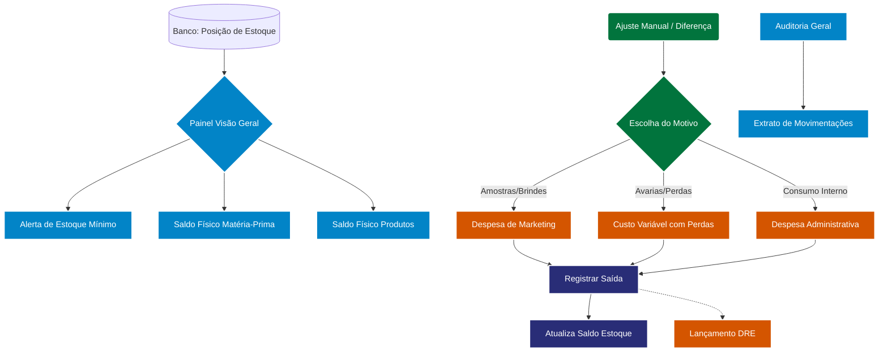

# Fluxograma: Módulo de Estoque

```mermaid
flowchart TD
    classDef view fill:#0284c7,stroke:#fff,stroke-width:2px,color:#fff
    classDef action fill:#01743d,stroke:#fff,stroke-width:2px,color:#fff
    classDef system fill:#292d77,stroke:#fff,stroke-width:2px,color:#fff
    classDef dre fill:#d45500,stroke:#fff,stroke-width:2px,color:#fff

    A[(Banco: Posição de Estoque)] --> B{Painel Visão Geral}
    
    B --> C[Alerta de Estoque Mínimo]
    B --> D[Saldo Físico Matéria-Prima]
    B --> E[Saldo Físico Produtos]

    F(Ajuste Manual / Diferença) --> G{Escolha do Motivo}
    G -->|Amostras/Brindes| H[Despesa de Marketing]
    G -->|Avarias/Perdas| I[Custo Variável com Perdas]
    G -->|Consumo Interno| J[Despesa Administrativa]

    H --> K[Registrar Saída]
    I --> K
    J --> K

    K --> L[Atualiza Saldo Estoque]
    K -.-> M[Lançamento DRE]

    N[Auditoria Geral] --> O[Extrato de Movimentações]

    class B,C,D,E,N,O view
    class F,G action
    class K,L system
    class H,I,J,M dre
```
