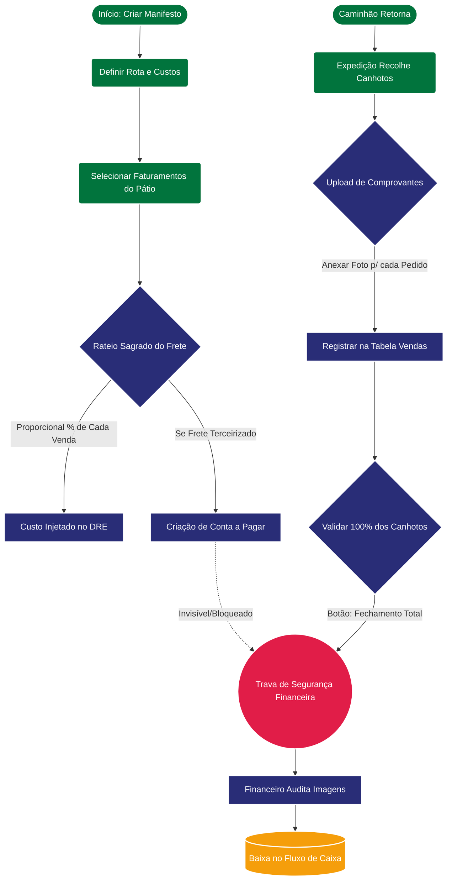

# Fluxograma: Módulo de Logística

```mermaid
flowchart TD
    classDef operator fill:#01743d,stroke:#fff,stroke-width:2px,color:#fff
    classDef system fill:#292d77,stroke:#fff,stroke-width:2px,color:#fff
    classDef database fill:#f59e0b,stroke:#fff,stroke-width:2px,color:#fff
    classDef warning fill:#e11d48,stroke:#fff,stroke-width:2px,color:#fff

    A([Início: Criar Manifesto]) --> B(Definir Rota e Custos)
    B --> C(Selecionar Faturamentos do Pátio)
    C --> D{Rateio Sagrado do Frete}
    
    D -->|Proporcional % de Cada Venda| E[Custo Injetado no DRE]
    D -->|Se Frete Terceirizado| F[Criação de Conta a Pagar]
    
    F -.->|Invisível/Bloqueado| G((Trava de Segurança Financeira))
    
    H([Caminhão Retorna]) --> I(Expedição Recolhe Canhotos)
    I --> J{Upload de Comprovantes}
    
    J -->|Anexar Foto p/ cada Pedido| K[Registrar na Tabela Vendas]
    K --> L{Validar 100% dos Canhotos}
    L -->|Botão: Fechamento Total| G
    
    G --> M[Financeiro Audita Imagens]
    M --> N[(Baixa no Fluxo de Caixa)]

    class A,B,C,H,I operator
    class D,E,F,J,K,L,M system
    class G warning
    class N database
```
