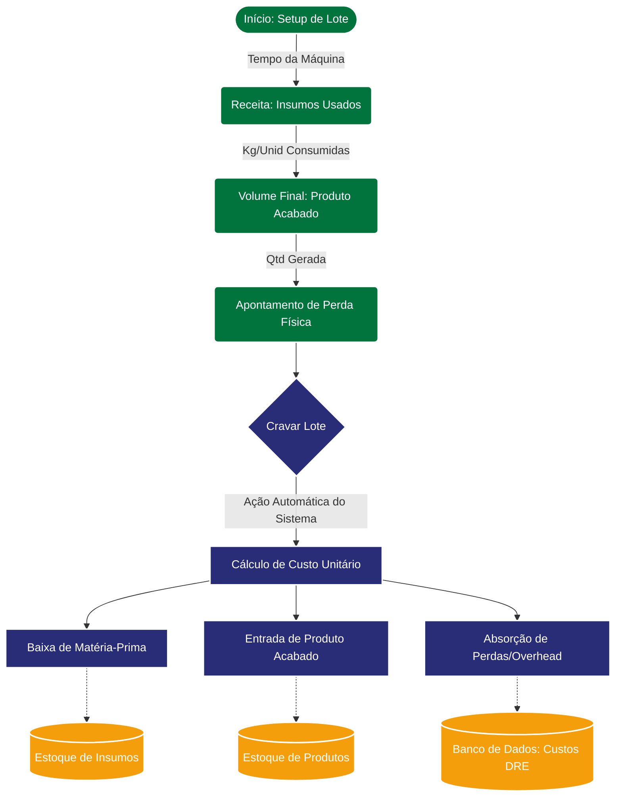

# Fluxograma: Módulo de Produção

```mermaid
flowchart TD
    classDef operator fill:#01743d,stroke:#fff,stroke-width:2px,color:#fff
    classDef system fill:#292d77,stroke:#fff,stroke-width:2px,color:#fff
    classDef database fill:#f59e0b,stroke:#fff,stroke-width:2px,color:#fff

    A([Início: Setup de Lote]) -->|Tempo da Máquina| B(Receita: Insumos Usados)
    B -->|Kg/Unid Consumidas| C(Volume Final: Produto Acabado)
    C -->|Qtd Gerada| D(Apontamento de Perda Física)
    D --> E{Cravar Lote}

    E -->|Ação Automática do Sistema| F[Cálculo de Custo Unitário]
    F --> G[Baixa de Matéria-Prima]
    F --> H[Entrada de Produto Acabado]
    F --> I[Absorção de Perdas/Overhead]

    G -.-> DB1[(Estoque de Insumos)]
    H -.-> DB2[(Estoque de Produtos)]
    I -.-> DB3[(Banco de Dados: Custos DRE)]

    class A,B,C,D operator
    class E,F,G,H,I system
    class DB1,DB2,DB3 database
```
