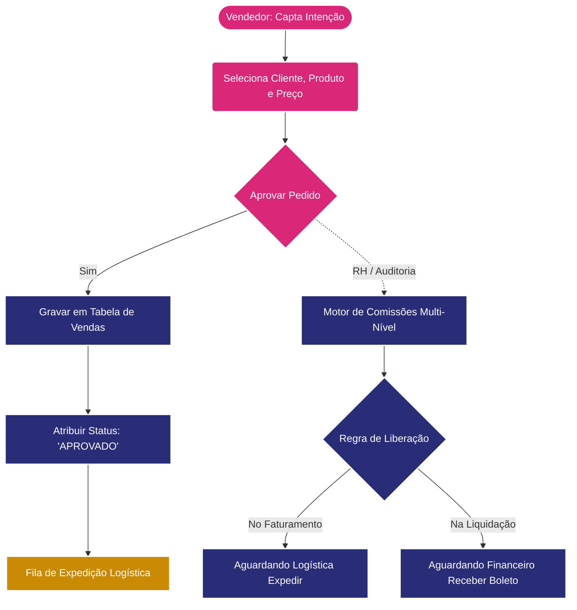

# Fluxograma: Módulo de Pedidos de Venda

```mermaid
flowchart TD
    classDef comercial fill:#db2777,stroke:#fff,stroke-width:2px,color:#fff
    classDef system fill:#292d77,stroke:#fff,stroke-width:2px,color:#fff
    classDef fila fill:#ca8a04,stroke:#fff,stroke-width:2px,color:#fff

    A([Vendedor: Capta Intenção]) --> B(Seleciona Cliente, Produto e Preço)
    B --> C{Aprovar Pedido}

    C -->|Sim| D[Gravar em Tabela de Vendas]
    D --> E[Atribuir Status: 'APROVADO']
    
    E --> F[Fila de Expedição Logística]
    
    C -.->|RH / Auditoria| G[Motor de Comissões Multi-Nível]
    G --> H{Regra de Liberação}
    H -->|No Faturamento| I[Aguardando Logística Expedir]
    H -->|Na Liquidação| J[Aguardando Financeiro Receber Boleto]

    class A,B,C comercial
    class D,E,G,H,I,J system
    class F fila
```
